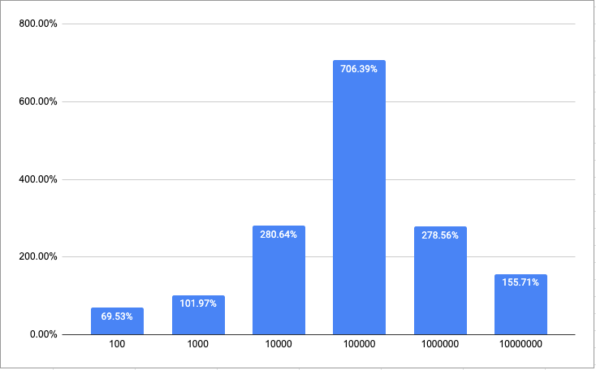
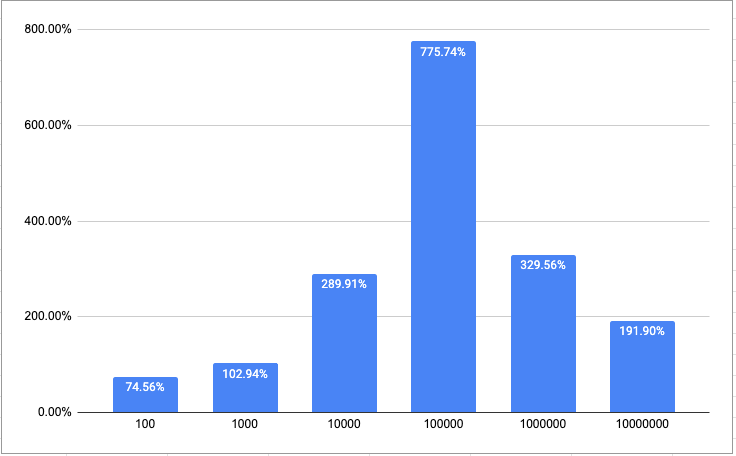
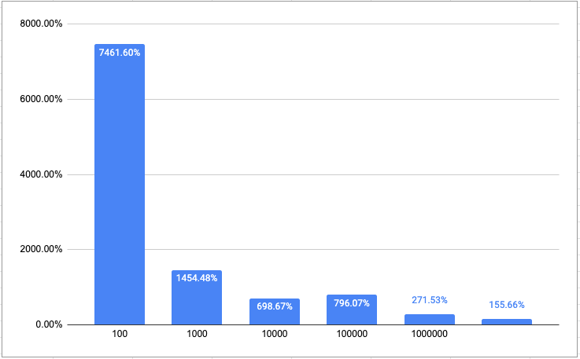
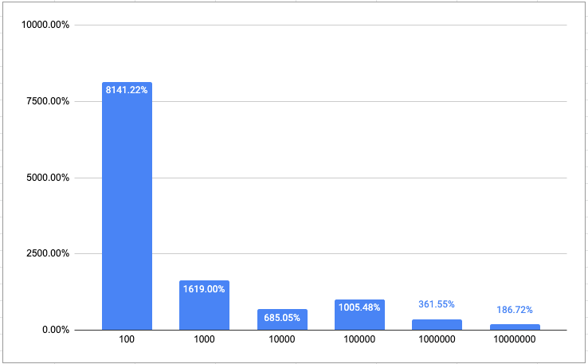

# Merkle Tree
Merkle Tree by GPU

## Team Members
- Morris (Chun-Ting) Shen 
- Oscar Hsu
- Po-Yuan Huang
- Pin-Tsung Huang

## Code Locations
Currently, there are two versions with separate `README.md` in their directories:
- CPU: `merkle_tree/merkle_tree_cpu`
- GPU: `merkle_tree/merkle_tree_gpu`

## Acceleration Methods
Currently, we have accelerated two Merkle Tree operations:
- Creation (`ACCEL_CREATION`): from raw data, make Merkle leaf nodes.
- Reducation (`ACCEL_REDUCTION`): from all Merkle leaf nodes, derive root node.
  * Still WIP; root hash is available but cannot find siblings yet.

**(Only applies to GPU version!)**
To set the acceleration mode, use a bitmask:
```C++
unsigned short ACCEL_MASK = NO_ACCEL;
MerkleTree mt(data, data_len, hasher, ACCEL_MASK);
// no acceleration happens, pure CPU.
```
or
```C++
unsigned short ACCEL_MASK = ACCEL_CREATION;
MerkleTree mt(data, data_len, hasher, ACCEL_MASK);
// creation acceleration
```
or
```C++
unsigned short ACCEL_MASK = ACCEL_CREATION | ACCEL_REDUCTION;
MerkleTree mt(data, data_len, hasher, ACCEL_MASK);
// full GPU acceleration
```


## Preliminary Results
By offloading hashing algorithms to the GPU side, we are seeing signigicant
speed-ups in data sizes larger than 1GB, and it's most significant in 10GB with
block size set to 100KB in our preliminary tests.

The best speed-up we can achieve at the moment is *78x*.

The speed-up charts are as follow (x-axis is `block_size`):

**Creation Acceleration**
- `data_len = 1000000000` (~ 1GB)
  
- `data_len = 10000000000` (~ 10GB)
  

**Full Acceleration (Creation + Reduction)**
- `data_len = 1000000000` (~ 1GB)
  
- `data_len = 10000000000` (~ 10GB)
  

## Generate/Load `TestData`
```C++
#include "testdata.hpp"

// cache_path is default to "cached_test_data" in benchmark programs.
TestData td(data_len, block_size, "CPU", cache_path);

// return a tuple of (string, unsigned char*, unsigned long long).
tie(config, data, data_len) = td.get_test_data();
```
`get_test_data()` return the tuple above directly if test data has been loaded
from cache files (or generated and then loaded).

Test data generation uses `<random>` with a fixed seed (`42`) from C++ library.

## Usage of `Timer`
```C++
#include "timer.hpp"

start_timer("Test_1_GPU");  // insert a config name here
// do_something_expensive();
stop_timer();

print_timer();
// Test_1_GPU:  55688 ms

print_timer_csv();
// Test_1_GPU,55688
```

## Credits
We use GPU versions of hash algorithms from
[CUDA Hashing Algorithms Collection](https://github.com/mochimodev/cuda-hashing-algos) by Matt Zweil & The Mochimo Core Contributor Team.
